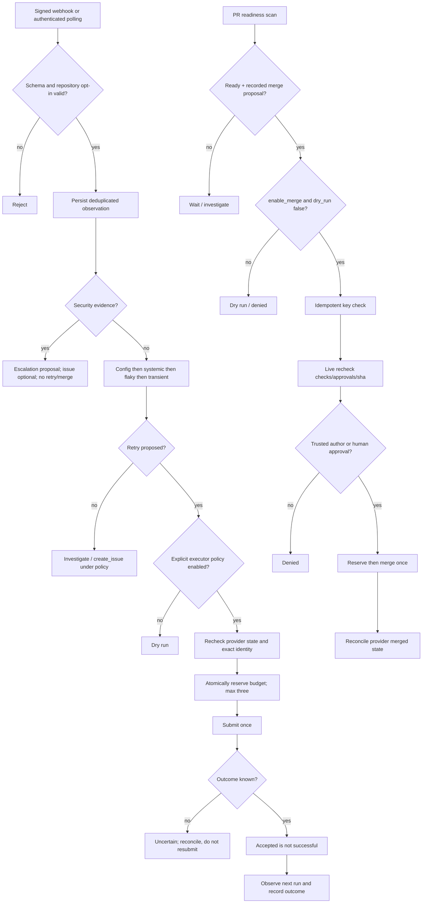

# Remediation decision tree

Quarantine means a proposed reviewed change, never automatic removal of required checks. Revert, dependency-update, and open_pr action types remain unimplemented and fail closed. Merge and create_issue are implemented behind explicit policy flags (`enable_merge`, `enable_issues`), repository allowlists, dry-run default, durable reservation, live recheck, and uncertain-submission reconciliation. Statistical classification thresholds require enough historical samples; a single failure cannot establish systemic or flaky behavior.
