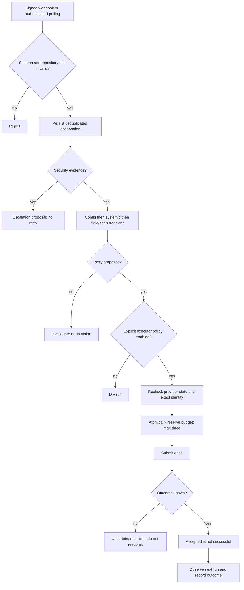

# Remediation decision tree

Quarantine means a proposed reviewed change, never automatic removal of required checks. Merge/revert/dependency updates have no executable path in this release. Statistical classification thresholds require enough historical samples; a single failure cannot establish systemic or flaky behavior.
