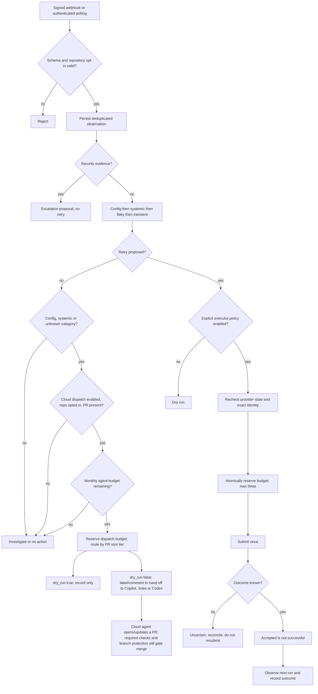

# Remediation decision tree

Quarantine means a proposed reviewed change, never automatic removal of required checks. Merge/revert/dependency updates have no executable path in this release. Statistical classification thresholds require enough historical samples; a single failure cannot establish systemic or flaky behavior.

Cloud-agent dispatch (`config`/`systemic`/`unknown` categories only; `security` and `healthy` are never dispatched, and `transient`/`flaky` stay on the existing retry path) hands a classified failure to an already-trusted GitHub cloud coding agent by labeling or commenting on the associated pull request. It never merges, reverts or edits code itself — the cloud agent produces its own commits, and the existing required-status-check and branch-protection path governs merge. Dispatch is disabled and `dry_run:true` by default; a repository must be explicitly opted in.
